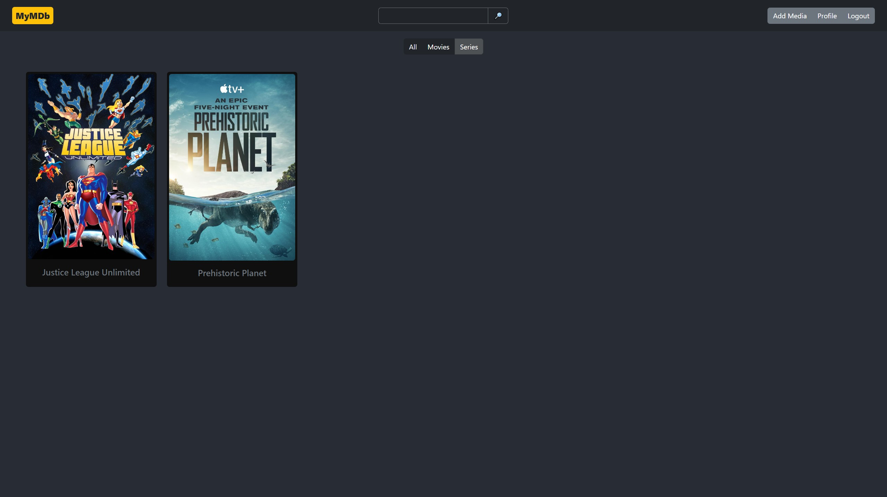
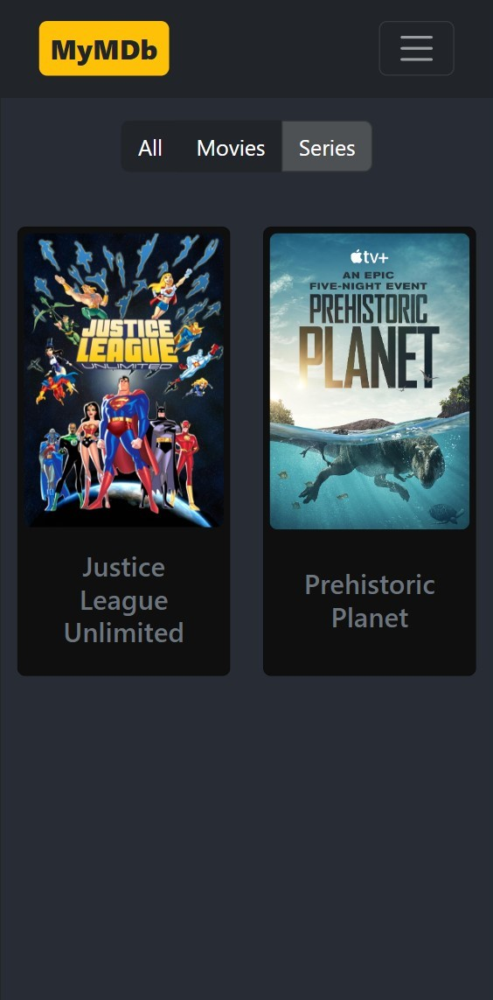

# MyMDb

**MyMDb** stands for **My Movie Database**. It is a project that includes a web application with a .NET API and a React client.

This web app is designed for administrators to add movies or series that are not available on any streaming services, and for users to watch them from anywhere. Users can also leave reviews to help their friends decide whether they should watch the content or not.

## Frontend

The site features an intuitive and user-friendly interface, providing easy navigation for users and administrators alike. Key elements include:

- **Logo**: Links to the homepage.
- **Navigation Bar**: Includes a **Login** button and other important actions.
- **Library Section**: Displays a triple button for filtering media types, with results listed responsively based on screen dimensions.

    
    

---

## Backend

The backend consists of a **Microsoft SQL Server Database**, with defined entities and relationships, managed by a **.NET API** developed in C#. It utilizes several frameworks and libraries:

- **Entity Framework**
- **Identity Framework**
- **Jwt Bearer Authentication**
- **AutoMapper**

Here's a visual representation of the entity relationships in the database:

---

## Configuration

### appsettings.json

The configuration file `appsettings.json` includes essential settings that need to be added manually.

### Key Highlights:

- **Flexible Configuration**: Easily manage environment-specific settings like database connection strings and JWT secrets.
- **Logging Control**: Adjust logging levels to ensure appropriate visibility for various parts of the application.
- **Seeding and Administration**: Pre-configure administrator credentials and server settings for initial setup.

Below is an overview of the sections:

| **Section**           | **Key**                               | **Description**                                                              |
| --------------------- | ------------------------------------- | ---------------------------------------------------------------------------- |
| **ConnectionStrings** | `LinuxDefaultConnection`              | The connection string for the database in a Linux environment.               |
|                       | `WindowsDefaultConnection`            | The connection string for the database in a Windows environment.             |
| **Logging**           | `LogLevel.Default`                    | The general logging level (e.g., `Information`, `Warning`, etc.).            |
|                       | `LogLevel.Microsoft.AspNetCore`       | The logging level for the `Microsoft.AspNetCore` namespace.                  |
|                       | `LogLevel.Microsoft.Hosting.Lifetime` | The specific logging level for the hosting lifecycle.                        |
| **AllowedHosts**      |                                       | A list of allowed hosts for the application. The value `*` allows all hosts. |
| **Jwt**               | `Key`                                 | The secret key used for signing and validating JWT tokens.                   |
|                       | `Issuer`                              | The issuer of the JWT tokens, typically representing your application.       |
| **Seeding**           | `AdminEmail`                          | The default administrator email used for seeding the database.               |
|                       | `AdminPassword`                       | The default administrator password used for seeding the database.            |
| **ConnectionDetails** | `AllowedClients`                      | A list of client IPs or identifiers allowed to connect to the server.        |
|                       | `ServerAddress`                       | The address of the server where the application is hosted.                   |
| **Paths**             | `Root`                                | The root directory for storing application files.                            |
|                       | `Videos`                              | The directory path, relative to `Root`, where video files are stored.        |
|                       | `Images`                              | The directory path, relative to `Root`, where image files are stored.        |
|                       | `ProfilePics`                         | The directory path, relative to `Root`, for storing user profile pictures.   |
|                       | `ShellScripts`                        | The directory path for storing shell scripts used by the application.        |
| **VideoBufferSize**   |                                       | The buffer size used for video processing or streaming, defined in bytes.    |
